# Architecture Overview

This document describes the architecture of the Vercel OAuth2 Provider library.

## Table of Contents

- [High-Level Architecture](#high-level-architecture)
- [Component Diagram](#component-diagram)
- [OAuth 2.0 Flow](#oauth-20-flow)
- [Class Structure](#class-structure)
- [Sequence Diagrams](#sequence-diagrams)
- [Data Flow](#data-flow)
- [Security Architecture](#security-architecture)

## High-Level Architecture

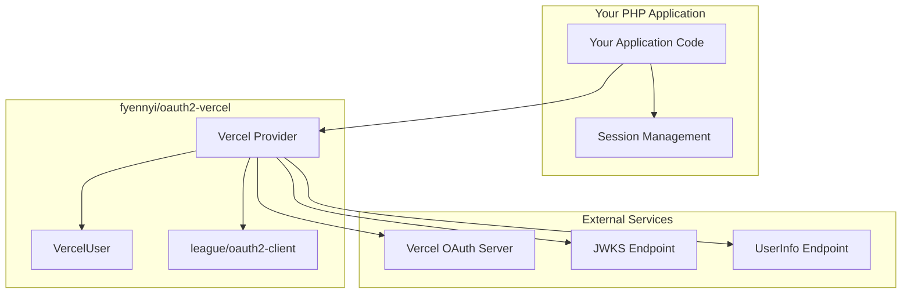

## Component Diagram

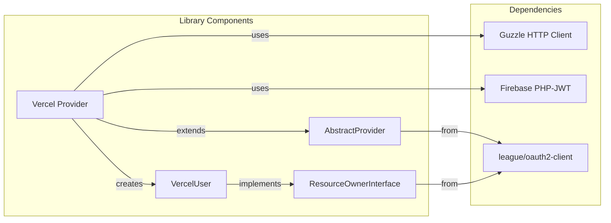

## OAuth 2.0 Flow

### Authorization Code Flow with PKCE

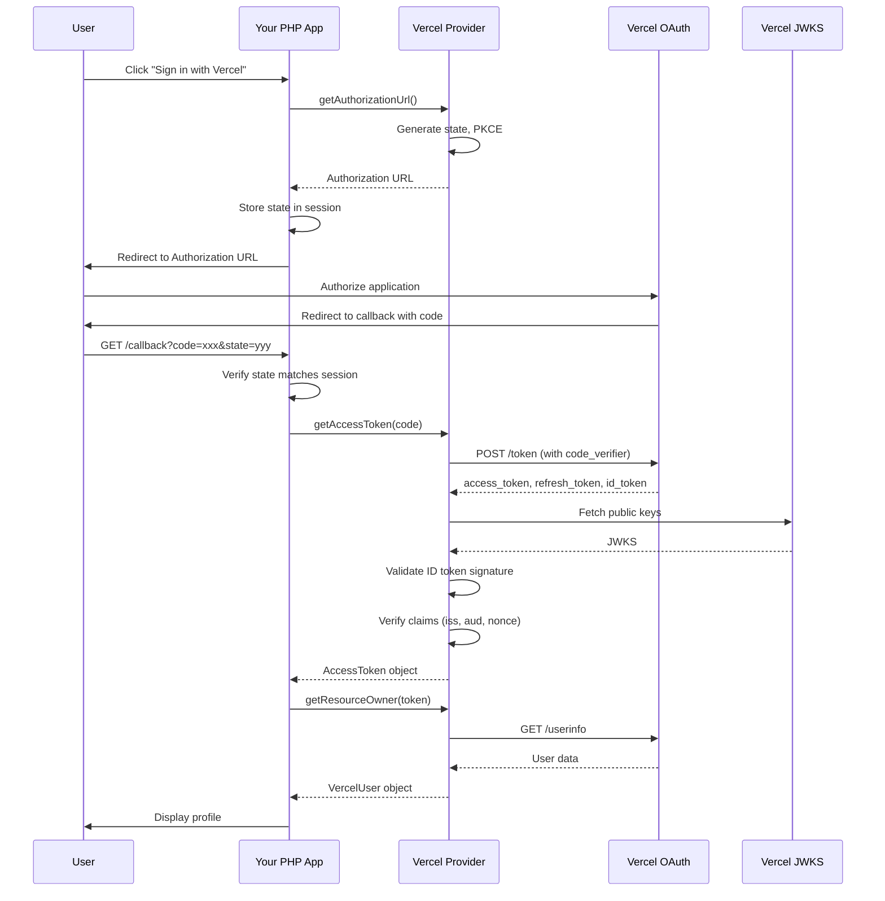

## Class Structure

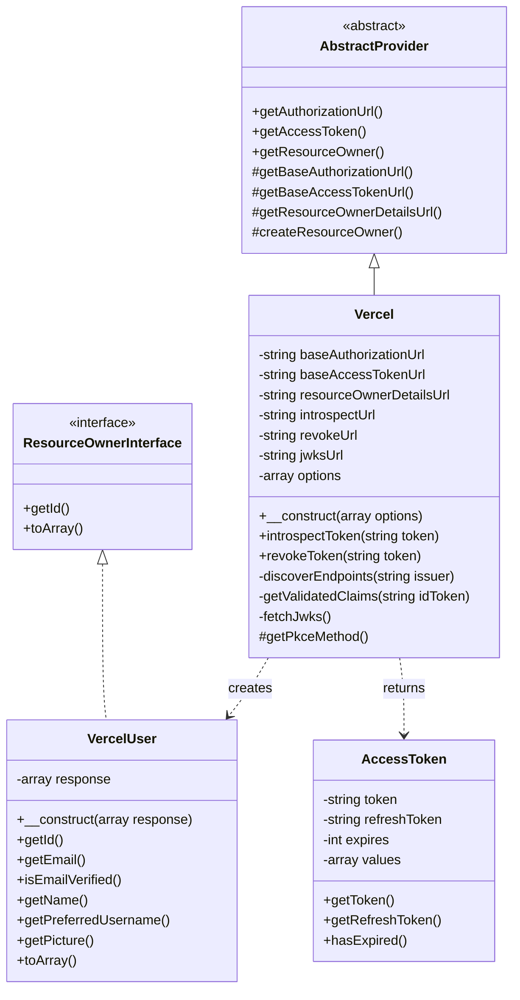

## Sequence Diagrams

### OIDC Discovery

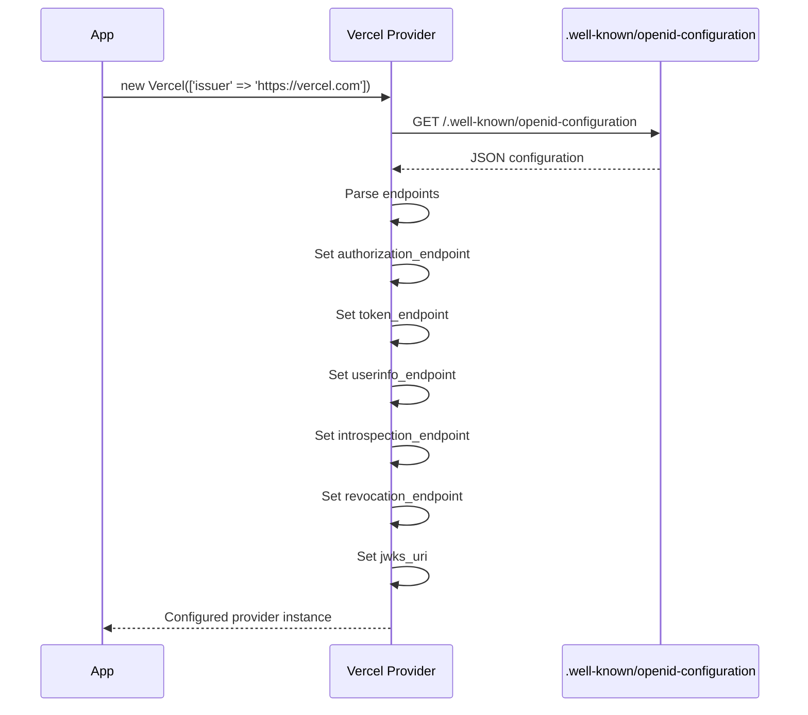

### ID Token Validation

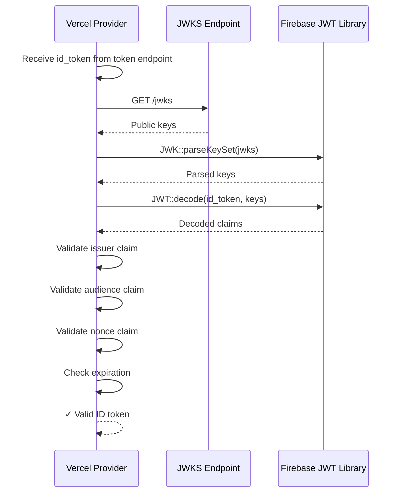

### Token Introspection

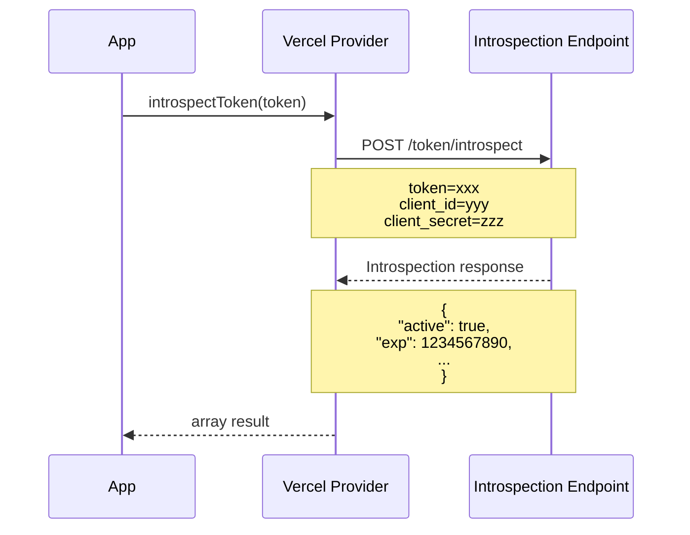

## Data Flow

### Token Storage and Retrieval

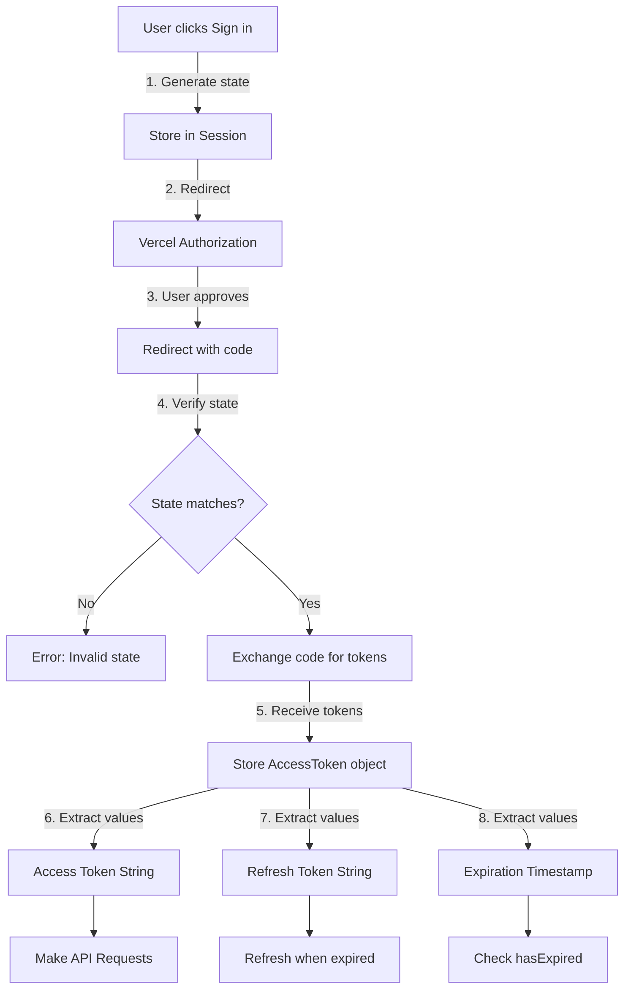

### User Data Retrieval Flow

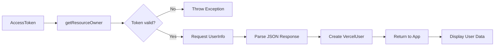

## Security Architecture

### PKCE Implementation

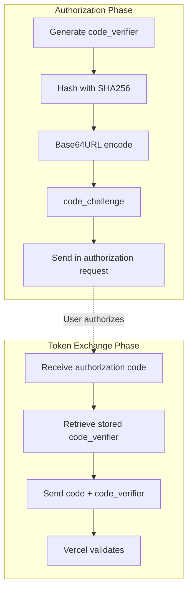

### Multi-Layer Security

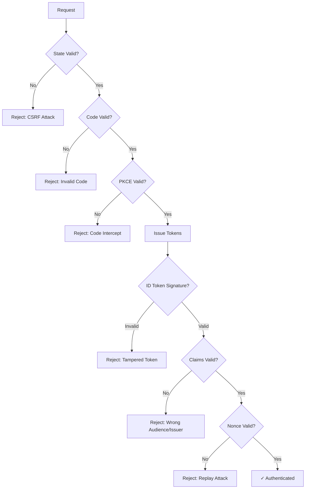

## System Integration

### Integration Points

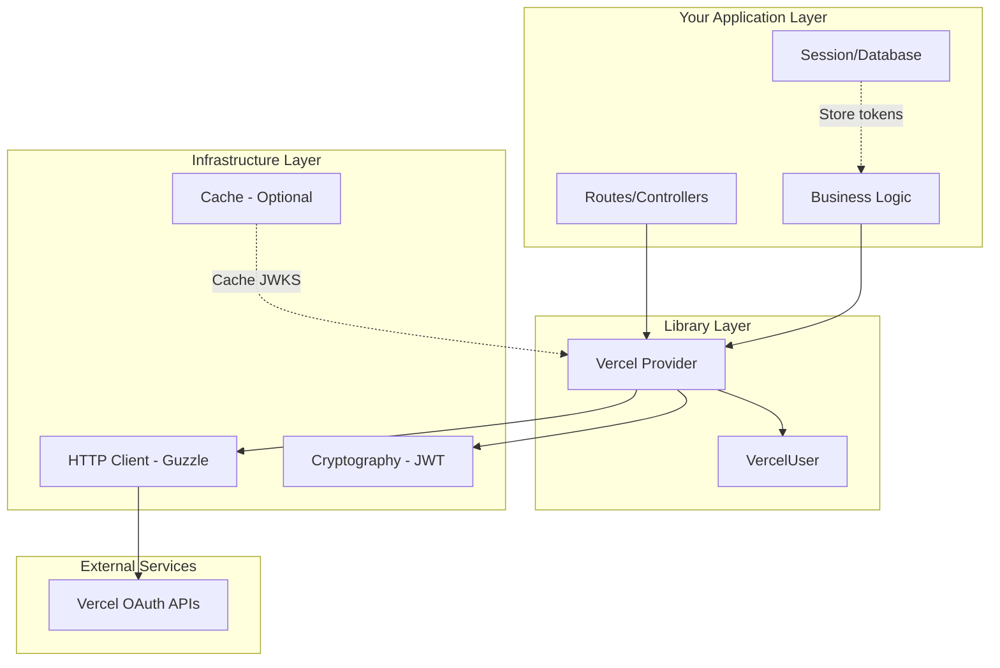

## Error Handling Architecture

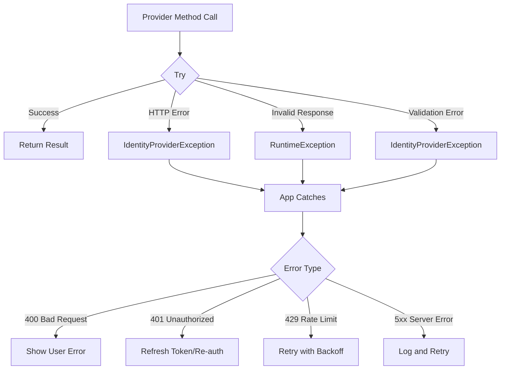

## Performance Considerations

### Caching Strategy

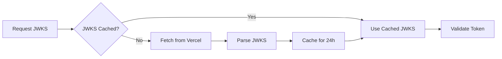

### Token Lifecycle

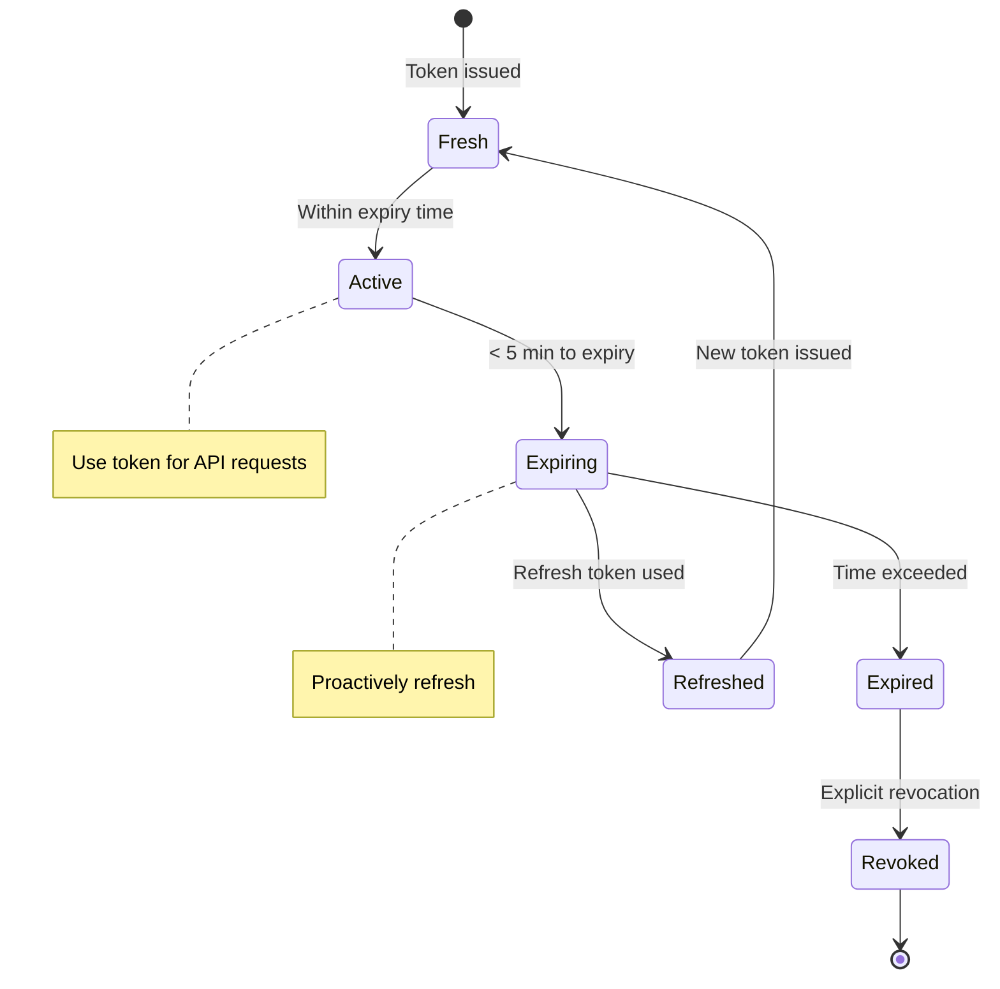

## Extension Points

The library provides several extension points for customization:

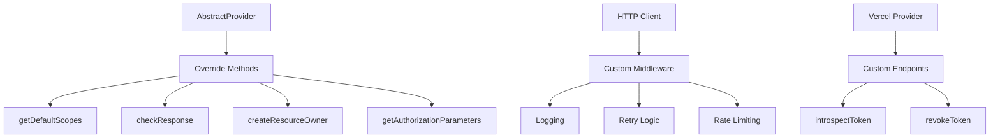

## Deployment Architecture

```mermaid
graph TB
    subgraph "Development"
        Dev[localhost:3000]
        DevSession[File-based Sessions]
    end
    
    subgraph "Staging"
        Staging[staging.yourapp.com]
        StagingSession[Redis Sessions]
        StagingDB[(Session DB)]
    end
    
    subgraph "Production"
        Prod1[app1.yourapp.com]
        Prod2[app2.yourapp.com]
        LoadBalancer[Load Balancer]
        ProdSession[Distributed Sessions]
        ProdDB[(Session Store)]
    end
    
    Dev --> DevSession
    Staging --> StagingSession
    StagingSession --> StagingDB
    
    LoadBalancer --> Prod1
    LoadBalancer --> Prod2
    Prod1 --> ProdSession
    Prod2 --> ProdSession
    ProdSession --> ProdDB
```

## Summary

The Vercel OAuth2 Provider architecture is designed with:

- **Separation of Concerns**: Clear boundaries between provider logic, HTTP communication, and user data
- **Security First**: Multiple layers of validation (state, PKCE, signature, claims)
- **Extensibility**: Built on league/oauth2-client standard with custom extensions
- **Error Handling**: Comprehensive exception handling at every layer
- **Performance**: Optional caching of JWKS and efficient token validation
- **Standards Compliance**: Follows OAuth 2.0, OIDC, and PSR standards

The architecture ensures secure, maintainable, and scalable integration with Vercel's authentication service.
