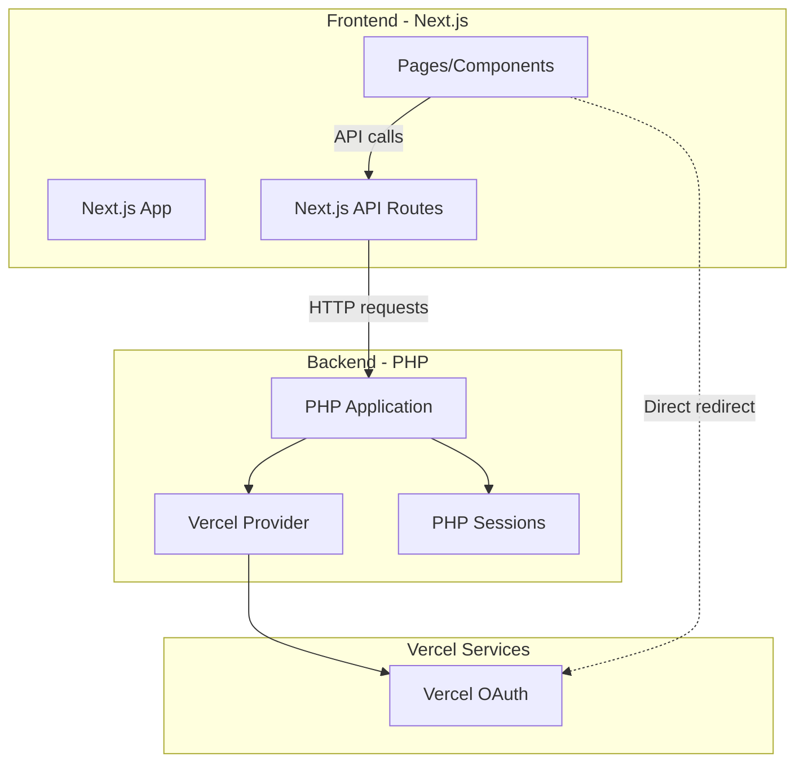

# Next.js Integration Guide

This guide shows how to integrate the PHP Vercel OAuth2 provider with a Next.js frontend application.

## Table of Contents

- [Architecture Overview](#architecture-overview)
- [Use Cases](#use-cases)
- [Setup](#setup)
- [Implementation Patterns](#implementation-patterns)
- [API Routes Bridge](#api-routes-bridge)
- [Full Stack Example](#full-stack-example)
- [Best Practices](#best-practices)

## Architecture Overview



## Use Cases

This integration is useful when:

1. **Microservices Architecture**: Next.js frontend + PHP backend services
2. **Legacy Migration**: Migrating from PHP to Next.js gradually
3. **Hybrid Applications**: Using both Next.js and PHP in the same project
4. **Backend Services**: PHP handling auth, Next.js handling UI

## Setup

### Prerequisites

1. **PHP Backend** with the Vercel OAuth2 provider:
   ```bash
   composer require fyennyi/oauth2-vercel
   ```

2. **Next.js Frontend**:
   ```bash
   npx create-next-app@latest my-app
   cd my-app
   npm install
   ```

### Environment Variables

**PHP Backend (.env):**
```env
VERCEL_APP_CLIENT_ID=your_client_id
VERCEL_APP_CLIENT_SECRET=your_client_secret
VERCEL_REDIRECT_URI=https://api.yourapp.com/auth/callback
SESSION_SECRET=your_session_secret
FRONTEND_URL=https://yourapp.com
```

**Next.js Frontend (.env.local):**
```env
NEXT_PUBLIC_API_URL=https://api.yourapp.com
NEXT_PUBLIC_AUTH_URL=https://api.yourapp.com/auth
```

## Implementation Patterns

### Pattern 1: PHP Handles All Auth Logic

The PHP backend manages the complete OAuth flow, and Next.js just redirects users.

**Next.js Component:**

```typescript
// app/components/SignInButton.tsx
'use client';

export default function SignInButton() {
  const handleSignIn = () => {
    // Redirect to PHP backend authorization endpoint
    window.location.href = `${process.env.NEXT_PUBLIC_API_URL}/auth/login`;
  };

  return (
    <button onClick={handleSignIn}>
      Sign in with Vercel
    </button>
  );
}
```

**PHP Backend (login.php):**

```php
<?php
require 'vendor/autoload.php';

session_start();

$provider = new \Fyennyi\OAuth2\Client\Provider\Vercel([
    'clientId'     => $_ENV['VERCEL_APP_CLIENT_ID'],
    'clientSecret' => $_ENV['VERCEL_APP_CLIENT_SECRET'],
    'redirectUri'  => $_ENV['VERCEL_REDIRECT_URI'],
]);

// Generate authorization URL
$authUrl = $provider->getAuthorizationUrl([
    'scope' => ['openid', 'email', 'profile', 'offline_access']
]);

// Store state
$_SESSION['oauth2state'] = $provider->getState();

// Redirect to Vercel
header('Location: ' . $authUrl);
exit;
```

**PHP Backend (callback.php):**

```php
<?php
require 'vendor/autoload.php';

session_start();

$provider = new \Fyennyi\OAuth2\Client\Provider\Vercel([
    'clientId'     => $_ENV['VERCEL_APP_CLIENT_ID'],
    'clientSecret' => $_ENV['VERCEL_APP_CLIENT_SECRET'],
    'redirectUri'  => $_ENV['VERCEL_REDIRECT_URI'],
]);

// Verify state
if ($_GET['state'] !== $_SESSION['oauth2state']) {
    header('Location: ' . $_ENV['FRONTEND_URL'] . '/auth/error?error=invalid_state');
    exit;
}

try {
    // Exchange code for token
    $accessToken = $provider->getAccessToken('authorization_code', [
        'code' => $_GET['code']
    ]);

    // Get user info
    $user = $provider->getResourceOwner($accessToken);

    // Store in session
    $_SESSION['access_token'] = $accessToken->getToken();
    $_SESSION['refresh_token'] = $accessToken->getRefreshToken();
    $_SESSION['user_id'] = $user->getId();
    $_SESSION['user_email'] = $user->getEmail();

    // Redirect back to Next.js frontend
    header('Location: ' . $_ENV['FRONTEND_URL'] . '/dashboard');
    exit;

} catch (Exception $e) {
    header('Location: ' . $_ENV['FRONTEND_URL'] . '/auth/error?error=' . urlencode($e->getMessage()));
    exit;
}
```

### Pattern 2: PHP API + Next.js API Routes

Next.js API routes communicate with PHP backend APIs.

**Next.js API Route:**

```typescript
// app/api/auth/user/route.ts
import { NextRequest, NextResponse } from 'next/server';
import { cookies } from 'next/headers';

export async function GET(request: NextRequest) {
  const cookieStore = await cookies();
  const sessionId = cookieStore.get('session_id')?.value;

  if (!sessionId) {
    return NextResponse.json({ error: 'Not authenticated' }, { status: 401 });
  }

  try {
    // Call PHP backend API
    const response = await fetch(
      `${process.env.NEXT_PUBLIC_API_URL}/api/user`,
      {
        headers: {
          'Cookie': `PHPSESSID=${sessionId}`,
        },
      }
    );

    if (!response.ok) {
      throw new Error('Failed to fetch user');
    }

    const user = await response.json();
    return NextResponse.json(user);

  } catch (error) {
    return NextResponse.json(
      { error: 'Failed to fetch user data' },
      { status: 500 }
    );
  }
}
```

**PHP Backend API (api/user.php):**

```php
<?php
require 'vendor/autoload.php';

session_start();

header('Content-Type: application/json');
header('Access-Control-Allow-Origin: ' . $_ENV['FRONTEND_URL']);
header('Access-Control-Allow-Credentials: true');

if (!isset($_SESSION['access_token'])) {
    http_response_code(401);
    echo json_encode(['error' => 'Not authenticated']);
    exit;
}

$provider = new \Fyennyi\OAuth2\Client\Provider\Vercel([
    'clientId'     => $_ENV['VERCEL_APP_CLIENT_ID'],
    'clientSecret' => $_ENV['VERCEL_APP_CLIENT_SECRET'],
    'redirectUri'  => $_ENV['VERCEL_REDIRECT_URI'],
]);

try {
    $accessToken = new \League\OAuth2\Client\Token\AccessToken([
        'access_token' => $_SESSION['access_token'],
        'refresh_token' => $_SESSION['refresh_token'],
    ]);

    // Refresh if expired
    if ($accessToken->hasExpired() && $_SESSION['refresh_token']) {
        $accessToken = $provider->getAccessToken('refresh_token', [
            'refresh_token' => $_SESSION['refresh_token']
        ]);
        
        $_SESSION['access_token'] = $accessToken->getToken();
        $_SESSION['refresh_token'] = $accessToken->getRefreshToken();
    }

    $user = $provider->getResourceOwner($accessToken);

    echo json_encode([
        'id' => $user->getId(),
        'email' => $user->getEmail(),
        'name' => $user->getName(),
        'username' => $user->getPreferredUsername(),
        'picture' => $user->getPicture(),
    ]);

} catch (Exception $e) {
    http_response_code(500);
    echo json_encode(['error' => $e->getMessage()]);
}
```

### Pattern 3: Session Bridge

Share authentication state between Next.js and PHP using a shared session store (Redis).

**PHP Backend (with Redis):**

```php
<?php
require 'vendor/autoload.php';

// Configure Redis session handler
ini_set('session.save_handler', 'redis');
ini_set('session.save_path', 'tcp://127.0.0.1:6379');

session_start();

// ... rest of OAuth logic
```

**Next.js with Redis:**

```typescript
// lib/redis.ts
import { createClient } from 'redis';

const client = createClient({
  url: process.env.REDIS_URL
});

client.connect();

export async function getSession(sessionId: string) {
  const data = await client.get(`PHPREDIS_SESSION:${sessionId}`);
  return data ? JSON.parse(data) : null;
}
```

## API Routes Bridge

### Complete Bridge Implementation

**Next.js API Routes:**

```typescript
// app/api/auth/status/route.ts
import { NextResponse } from 'next/server';
import { cookies } from 'next/headers';

export async function GET() {
  const cookieStore = await cookies();
  const sessionId = cookieStore.get('PHPSESSID')?.value;

  if (!sessionId) {
    return NextResponse.json({ authenticated: false });
  }

  try {
    const response = await fetch(
      `${process.env.NEXT_PUBLIC_API_URL}/api/auth/status`,
      {
        headers: {
          Cookie: `PHPSESSID=${sessionId}`,
        },
      }
    );

    const data = await response.json();
    return NextResponse.json(data);

  } catch (error) {
    return NextResponse.json({ authenticated: false });
  }
}
```

```typescript
// app/api/auth/logout/route.ts
import { NextRequest, NextResponse } from 'next/server';
import { cookies } from 'next/headers';

export async function POST(request: NextRequest) {
  const cookieStore = await cookies();
  const sessionId = cookieStore.get('PHPSESSID')?.value;

  if (sessionId) {
    // Call PHP logout endpoint
    await fetch(`${process.env.NEXT_PUBLIC_API_URL}/auth/logout`, {
      method: 'POST',
      headers: {
        Cookie: `PHPSESSID=${sessionId}`,
      },
    });
  }

  // Clear session cookie
  cookieStore.delete('PHPSESSID');

  return NextResponse.json({ success: true });
}
```

**PHP Backend:**

```php
<?php
// api/auth/status.php
session_start();

header('Content-Type: application/json');
header('Access-Control-Allow-Origin: ' . $_ENV['FRONTEND_URL']);
header('Access-Control-Allow-Credentials: true');

$authenticated = isset($_SESSION['access_token']);

echo json_encode([
    'authenticated' => $authenticated,
    'user' => $authenticated ? [
        'id' => $_SESSION['user_id'] ?? null,
        'email' => $_SESSION['user_email'] ?? null,
    ] : null
]);
```

## Full Stack Example

### Project Structure

```
project/
├── frontend/              # Next.js application
│   ├── app/
│   │   ├── api/
│   │   │   └── auth/
│   │   │       ├── status/
│   │   │       └── logout/
│   │   ├── components/
│   │   │   └── SignInButton.tsx
│   │   ├── dashboard/
│   │   │   └── page.tsx
│   │   └── layout.tsx
│   └── package.json
│
└── backend/               # PHP application
    ├── vendor/
    ├── auth/
    │   ├── login.php
    │   ├── callback.php
    │   └── logout.php
    ├── api/
    │   ├── user.php
    │   └── auth/
    │       └── status.php
    └── composer.json
```

### Dashboard Component

```typescript
// app/dashboard/page.tsx
'use client';

import { useEffect, useState } from 'react';
import { useRouter } from 'next/navigation';

interface User {
  id: string;
  email: string;
  name: string;
  username: string;
  picture: string;
}

export default function Dashboard() {
  const [user, setUser] = useState<User | null>(null);
  const [loading, setLoading] = useState(true);
  const router = useRouter();

  useEffect(() => {
    async function checkAuth() {
      try {
        const response = await fetch('/api/auth/status');
        const data = await response.json();

        if (!data.authenticated) {
          router.push('/');
          return;
        }

        // Fetch user data
        const userResponse = await fetch('/api/auth/user');
        const userData = await userResponse.json();
        setUser(userData);

      } catch (error) {
        console.error('Auth check failed:', error);
        router.push('/');
      } finally {
        setLoading(false);
      }
    }

    checkAuth();
  }, [router]);

  const handleLogout = async () => {
    await fetch('/api/auth/logout', { method: 'POST' });
    router.push('/');
  };

  if (loading) {
    return <div>Loading...</div>;
  }

  return (
    <div>
      <h1>Dashboard</h1>
      {user && (
        <div>
          
          <h2>{user.name}</h2>
          <p>Email: {user.email}</p>
          <p>Username: @{user.username}</p>
          <button onClick={handleLogout}>Logout</button>
        </div>
      )}
    </div>
  );
}
```

## Best Practices

### 1. Security

**CORS Configuration (PHP):**

```php
<?php
// Configure CORS properly
$allowed_origins = [$_ENV['FRONTEND_URL']];
$origin = $_SERVER['HTTP_ORIGIN'] ?? '';

if (in_array($origin, $allowed_origins)) {
    header("Access-Control-Allow-Origin: $origin");
    header('Access-Control-Allow-Credentials: true');
    header('Access-Control-Allow-Methods: GET, POST, OPTIONS');
    header('Access-Control-Allow-Headers: Content-Type, Authorization');
}

if ($_SERVER['REQUEST_METHOD'] === 'OPTIONS') {
    http_response_code(204);
    exit;
}
```

### 2. Session Security

**PHP Session Configuration:**

```php
<?php
// Secure session configuration
ini_set('session.cookie_httponly', 1);
ini_set('session.cookie_secure', 1);  // Only over HTTPS
ini_set('session.cookie_samesite', 'Lax');
ini_set('session.use_strict_mode', 1);
```

### 3. Error Handling

**Unified Error Response:**

```typescript
// lib/api.ts
export async function apiCall(endpoint: string, options?: RequestInit) {
  try {
    const response = await fetch(
      `${process.env.NEXT_PUBLIC_API_URL}${endpoint}`,
      {
        ...options,
        credentials: 'include',
      }
    );

    if (!response.ok) {
      const error = await response.json();
      throw new Error(error.message || 'API request failed');
    }

    return await response.json();

  } catch (error) {
    console.error('API Error:', error);
    throw error;
  }
}
```

### 4. Token Refresh Strategy

**Automatic Token Refresh (PHP):**

```php
<?php
function getValidAccessToken($provider, &$session) {
    $accessToken = new \League\OAuth2\Client\Token\AccessToken([
        'access_token' => $session['access_token'],
        'refresh_token' => $session['refresh_token'],
        'expires' => $session['token_expires'],
    ]);

    // Refresh if expired
    if ($accessToken->hasExpired() && $session['refresh_token']) {
        $newToken = $provider->getAccessToken('refresh_token', [
            'refresh_token' => $session['refresh_token']
        ]);
        
        $session['access_token'] = $newToken->getToken();
        $session['refresh_token'] = $newToken->getRefreshToken();
        $session['token_expires'] = $newToken->getExpires();
        
        return $newToken;
    }

    return $accessToken;
}
```

### 5. State Management

**Next.js Auth Context:**

```typescript
// contexts/AuthContext.tsx
'use client';

import { createContext, useContext, useEffect, useState } from 'react';

interface AuthContextType {
  user: any;
  loading: boolean;
  login: () => void;
  logout: () => void;
}

const AuthContext = createContext<AuthContextType | undefined>(undefined);

export function AuthProvider({ children }: { children: React.ReactNode }) {
  const [user, setUser] = useState(null);
  const [loading, setLoading] = useState(true);

  useEffect(() => {
    checkAuth();
  }, []);

  async function checkAuth() {
    try {
      const response = await fetch('/api/auth/status');
      const data = await response.json();
      
      if (data.authenticated) {
        const userResponse = await fetch('/api/auth/user');
        const userData = await userResponse.json();
        setUser(userData);
      }
    } catch (error) {
      console.error('Auth check failed:', error);
    } finally {
      setLoading(false);
    }
  }

  const login = () => {
    window.location.href = `${process.env.NEXT_PUBLIC_API_URL}/auth/login`;
  };

  const logout = async () => {
    await fetch('/api/auth/logout', { method: 'POST' });
    setUser(null);
    window.location.href = '/';
  };

  return (
    <AuthContext.Provider value={{ user, loading, login, logout }}>
      {children}
    </AuthContext.Provider>
  );
}

export const useAuth = () => {
  const context = useContext(AuthContext);
  if (!context) {
    throw new Error('useAuth must be used within AuthProvider');
  }
  return context;
};
```

## Testing

### PHP Backend Testing

```php
<?php
// tests/AuthTest.php
use PHPUnit\Framework\TestCase;

class AuthTest extends TestCase
{
    public function testLoginRedirectsToVercel()
    {
        // Test implementation
    }

    public function testCallbackExchangesCode()
    {
        // Test implementation
    }
}
```

### Next.js Frontend Testing

```typescript
// __tests__/auth.test.tsx
import { render, screen } from '@testing-library/react';
import SignInButton from '@/components/SignInButton';

describe('SignInButton', () => {
  it('redirects to PHP backend on click', () => {
    render(<SignInButton />);
    const button = screen.getByRole('button');
    // Test implementation
  });
});
```

## Deployment

### Docker Compose Example

```yaml
version: '3.8'

services:
  frontend:
    build: ./frontend
    ports:
      - "3000:3000"
    environment:
      - NEXT_PUBLIC_API_URL=http://backend:8000
    depends_on:
      - backend

  backend:
    build: ./backend
    ports:
      - "8000:80"
    environment:
      - VERCEL_APP_CLIENT_ID=${VERCEL_APP_CLIENT_ID}
      - VERCEL_APP_CLIENT_SECRET=${VERCEL_APP_CLIENT_SECRET}
      - FRONTEND_URL=http://localhost:3000
    volumes:
      - ./backend:/var/www/html

  redis:
    image: redis:alpine
    ports:
      - "6379:6379"
```

## Conclusion

This integration approach allows you to:

- ✅ Leverage existing PHP OAuth infrastructure
- ✅ Build modern Next.js frontends
- ✅ Share authentication state seamlessly
- ✅ Maintain security best practices
- ✅ Scale independently

Choose the pattern that best fits your architecture and gradually migrate if needed.
